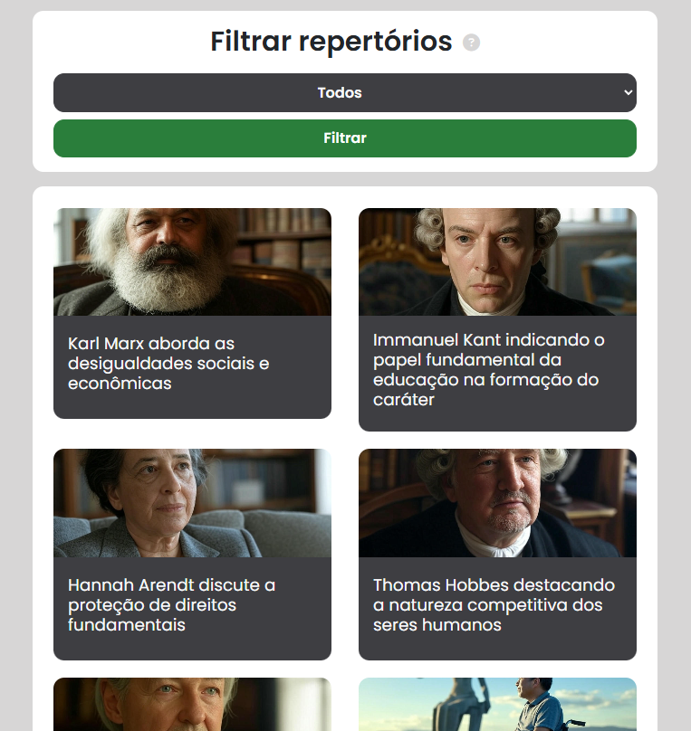
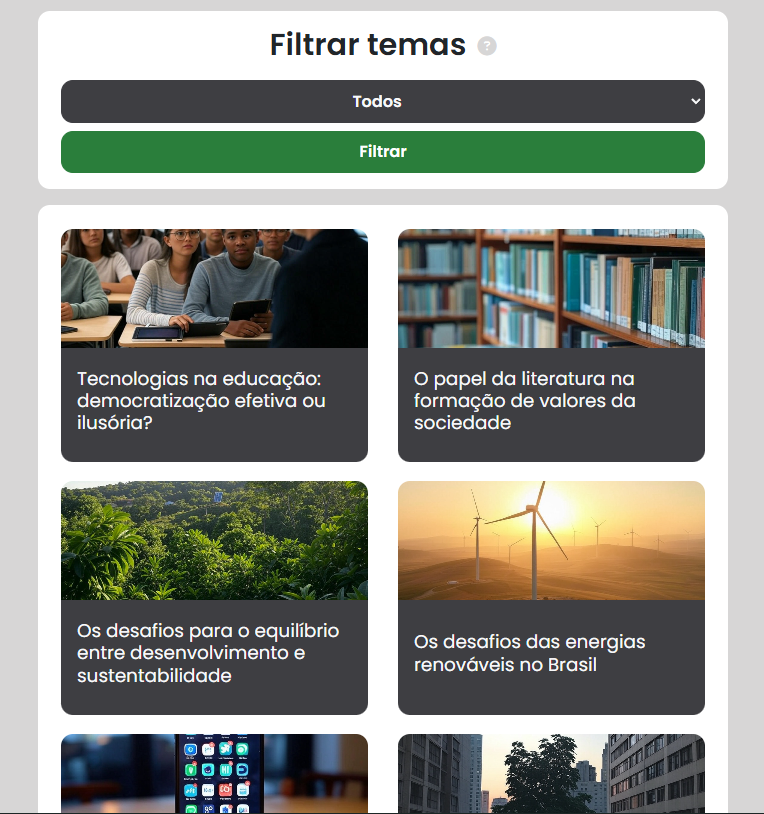
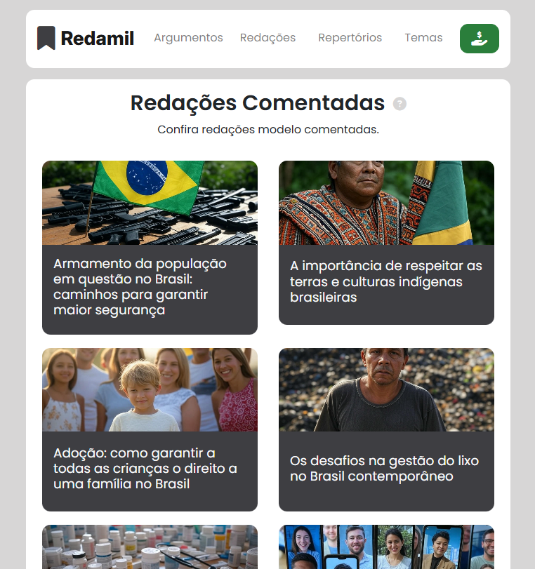

  <h1>Redamil é um site que disponibiliza conteúdo gratuito para estudo</h1>  

  

 

  <h2>Detalhes:</h2>

  <strong>Status</strong>: Finalizado  
  <strong>Tempo em desenvolvimento</strong>: Aproximadamente 3 semanas contando desde a prototipagem.   

  <h2>O que foi utilizado no projeto:</h2>

<ul>
  <li>Figma (prototipagem)</li>
  <li>HTML</li>
  <li>CSS</li>
  <li>Bootstrap 4</li>
  <li>PHP</li>
  <li>MySQL</li>
  <li>SQL</li>
</ul>

  <h2>O que o sistema faz:</h2>

<ul>
  <li>Entrega aos usuários conteúdos como redações modelo comentadas, argumentos, repertórios e temas para praticar a escrita para a redação do ENEM</li>
  <li>Na index apresenta um tema e um repertório para redação aleatório do banco de dados toda vez que é recarregado</li>
  <li>Em cada página de repertório/tema específico apresenta mais dois repertórios/temas aleatórios de recomendação</li>
  <li>Nas páginas de temas e relatórios possui uma filtragem por categoria</li>
</ul>

  <h2>Melhorias:</h2>

<ul>
  <li>Aprender e implementar prepared statement para diminuir a possibilidade de SQL Injection</li>
</ul>

  <h2>O que aprendi com este projeto:</h2>

<ul>
  <li>Criar um formulário para o usuário filtrar itens vindo do banco de dados</li>
  <li>Usar o random no PHP para recomendar conteúdo aleatório pro usuário</li>
</ul>

  <h2>Página com repetrórios</h2>  

  

  <h2>Página com temas de redação</h2>  

  

  <h2>Redações comentadas</h2>  

  

